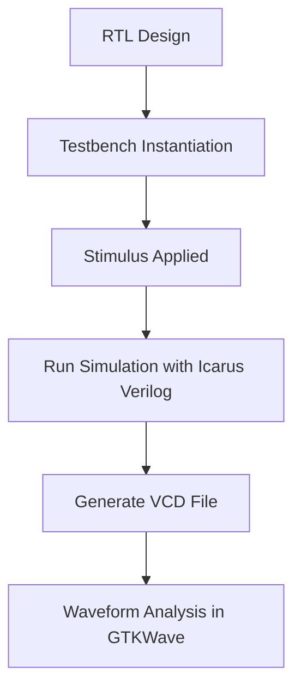

# 📅 Day 1 – Introduction to Verilog RTL Design & Synthesis

Welcome to Day 1 of the RISC-V SoC Tapeout Program. Today we'll explore how RTL code transforms into hardware, focusing on simulation, verification, and logic synthesis. This portfolio documents my hands-on experience, showcasing my understanding and practical skills.

---

## Part 1 – Open-Source Simulator (Icarus Verilog) + Lab

<details>
<summary>➡️  Icarus Verilog: Simulation & Verification</summary>

<details>
<summary>Theory</summary>

   
> ### 🔹 Simulator
   -    A tool used to **verify RTL designs against specifications**.
   -    It evaluates outputs **only when inputs change**.

> ### 🔹 RTL Design
* Verilog code that implements the **required functionality**.
* Can span **one or multiple files**.

> ### 🔹 Testbench (TB)
* Applies **stimulus (test vectors)** to the design under test and observes its outputs.
* **Testbenches have no primary inputs/outputs**; only the design has them.
* Key components:
    * **Stimulus Generator:** Generates input signals for the design.
    * **Stimulus Observer:** Monitors and verifies the output signals from the design.

> ### 🔹 Simulation Output
* Produces a **Value Change Dump (VCD) file** to record all signal changes over time.
* The **GTKWave** tool is used to visualize these waveforms and verify the design's correctness.

</details>

<details>
<summary>Simulation summary</summary>



</details>
</details>

---


<details>
<summary>➡️ Lab 1: Environment Setup</summary>

### Purpose
To set up the required environment and clone the workshop repository.

---

### Steps
#### Directory Setup
* Create a main directory for the project: `mkdir VLSI`
* Navigate into the new directory: `cd VLSI`


#### Git Cloning of Workshop Repository
* Go to the GitHub page for the **"Sky130 RTL Design and Synthesis Workshop."**
* Copy the repository link.
* Run `git clone <repo_link>` to download the files. This will create a `sky130_rtl_design_synthesis_workshop` directory.

---

### Directory Contents
The cloned repository contains the following key folders:
* `lib`: Contains Sky130 standard cell library files (`.lib`) used for synthesis.
* `Verilog_model`: Contains Verilog models of standard cells that correspond to the `.lib` files.
* `Verilog`: Contains lab experiments, including Verilog source files and their respective testbenches.

---

### Outcome
The environment is now fully set up, and all necessary libraries, models, and lab files are ready for use.


</details>
</details>

---


<details>
<summary>➡️  Lab 2: MUX Simulation with Icarus Verilog</summary>

>

In this lab, we'll practice loading Verilog designs, simulating them with Icarus Verilog, and visualizing signal behavior with GTKWave.  

This lab demonstrates how a simple 2-to-1 multiplexer (MUX) works and how to analyze its behavior using waveforms.

<details>
<summary>1️⃣  Design Folder & File Structure</summary>

Navigate to the folder containing all Verilog design files: `Verilog_files/`.

Every design file has a 1:1 corresponding testbench (TB).

**Examples:**

- `good_mux.v` → `tb_good_mux.v`  
- `bad_latch.v` → `tb_bad_latch.v`  

Design files implement the logic, while the testbench applies stimulus and observes outputs.

</details>

<details>
<summary>2️⃣  Load and Compile Design in Icarus Verilog</summary>

>
>
 >  
 **Step 1: Compile design and testbench**

 ```bash
     iverilog good_mux.v tb_good_mux.v
 ```

   * This generates an executable output file: a.out.

   **Step 2: Run the simulation**

```markdown
./a.out
```
* This creates a VCD file (dump.vcd) that records input/output signal changes.
* The duration of the simulation can be adjusted in the testbench (e.g., #300ns).
* The $finish command in the testbench's initial block controls how long the simulation runs.


  
</details>
<details> <summary>3️⃣  Open and Analyze Waveforms in GTKWave</summary>

Launch GTKWave:

    ```
    gtkwave tb_good_mux.vcd
    ```


**Visualize Signals:**
* Drag and drop the inputs (I0, I1, Select) and output (Y) from the "Signals" panel into the waveform pane.
* Click Zoom Fit to view the entire simulation timeline.
* Use zoom tools or mouse wheel to inspect specific regions.
* Use forward/backward transition arrows to trace signal changes precisely.

**Observe MUX Behavior:**
* Select = 0 → Output Y follows I0
* Select = 1 → Output Y follows I1
* Observe how the output changes only when the select line


</details>
<details> <summary>4️⃣. Design & Testbench Details</summary>

**Design: good_mux.v**
```markdown
// Define a module named 'good_mux'
// This is a 2-to-1 multiplexer: selects one of two inputs based on 'sel'
module good_mux (
    input i0,    // First input to the multiplexer
    input i1,    // Second input to the multiplexer
    input sel,   // Select signal: decides which input is passed to output
    output reg y // Output of the multiplexer (declared as 'reg' because it's assigned in an always block)
);

// Always block: executes whenever any of the inputs change
always @ (*) // '*' means "all inputs used in the block"
begin
    // If 'sel' is 1, output 'y' will take the value of 'i1'
    if(sel)
        y <= i1;   // If 'sel' is 1, output 'y' takes the value of 'i1'
    else 
        y <= i0;   // If 'sel' is 0, output 'y' takes the value of 'i0'
end

endmodule


```
* Inputs: I0, I1, Select Output: Y
* Implements a simple 2-to-1 MUX: output follows I1 if Select = 1, otherwise I0.

**Testbench: tb_good_mux.v**
* Instantiates the design as UUT (Unit Under Test)
* Generates stimulus for the inputs:
* Initial values: Select = 0, I0 = 0, I1 = 0
* Toggle Select every 75 ns
* Toggle I0 and I1 after specific intervals
* Dumps outputs to VCD file for waveform analysis
* No primary inputs/outputs in the testbench itself

```markdown
`timescale 1ns / 1ps
// Testbench for the good_mux module
module tb_good_mux;

    // Inputs to the multiplexer are declared as reg so we can drive them
    reg i0, i1, sel;

    // Output from the multiplexer is declared as wire
    wire y;

    // Instantiate the Unit Under Test (UUT)
    // Connect the signals of this testbench to the mux module
    good_mux uut (
        .sel(sel),
        .i0(i0),
        .i1(i1),
        .y(y)
    );

    // Initial block: runs once at the start of simulation
    initial begin
        // Create a Value Change Dump file for waveform viewing
        $dumpfile("tb_good_mux.vcd");
        $dumpvars(0, tb_good_mux);

        // Initialize inputs
        sel = 0;
        i0  = 0;
        i1  = 0;

        // Run simulation for 300 time units and then finish
        #300 $finish;
    end

    // Clocking/Stimulus blocks to toggle inputs
    // These generate changes on inputs at different intervals

    always #75 sel = ~sel;  // Toggle select every 75 time units
    always #10 i0  = ~i0;   // Toggle i0 every 10 time units
    always #55 i1  = ~i1;   // Toggle i1 every 55 time units

endmodule


```
  

</details>
</details>
---

## Part 2 – Logic Synthesis with Yosys + Lab

Logic synthesis is the process of converting **Register Transfer Level (RTL)** designs into a **gate-level netlist** using standard cell libraries. In this part, we will synthesize a 2-to-1 multiplexer (`good_mux.v`) using Yosys and analyze the output netlist.

---


<details>
<summary>➡️ 1️⃣ Overview of Logic Synthesis</summary>

**Purpose**  
- Convert high-level RTL design into a structural gate-level implementation.  
- Map RTL logic to **actual standard cells** from a `.lib` library.  
- Enable hardware realization of digital circuits.

**Key Components:**  
- **RTL Design:** Behavioral representation of a circuit written in an HDL. It describes *what the circuit should do*, not how it’s physically built.  
- **Synthesizer:** Tool that translates RTL code into a gate-level netlist.  
- **Front-End Libraries:** Collections of pre-designed logical modules used as building blocks.  
- **Netlist:** Final output file listing all gates and their interconnections to implement the RTL functionality.

### Technology Library (.lib)

**.lib files** contain comprehensive collections of **logical modules and standard cells**.

#### Contents of .lib:
- **Basic Gates:** AND, OR, NOT, NAND, NOR, XOR, etc.  
- **Multiple Variants of Each Gate:**  
  - Different input counts (2-input, 3-input, 4-input AND gates)  
  - Different performance characteristics (slow, medium, fast versions)  
  - Various drive strengths  

#### Key Properties:
- **Universal Functionality:** Contains sufficient cells to implement any Boolean logic function.  
- **Optimization Options:** Multiple flavors enable performance, power, and area trade-offs. [Why flavors?](#why-gate-flavors--timing-in-digital-circuits)
- **Technology Independence:** Supports implementation using universal gates (NAND/NOR alone can implement any function).

**Synthesis Flow:**  

  
*Diagram showing RTL + .lib → Synthesis → Netlist*


## Why Gate Flavors & Timing in Digital Circuits

---


Different flavors of logic gates are used to balance **speed, area, and power**. Proper selection ensures reliable operation at the desired clock frequency while avoiding **setup** and **hold violations**.

---


Consider a simple  circuit:


T<sub>CLK</sub> ≥ T<sub>CQ_A</sub> + T<sub>cCOMBI</sub> + T<sub>SETUP_B</sub>


The **maximum clock speed** is determined by the total delay from **Flip-Flop A → Combinational Logic → Flip-Flop B**.

Where:

- T<sub>CQ_A</sub> = Propagation delay of Flip-Flop A  
- T<sub>COMBI</sub> = Propagation delay of combinational logic  
- T<sub>SETUP_B</sub> = Setup time of Flip-Flop B  

**Maximum clock frequency:**

            F<sub>CLK</sub> = 1 / T<sub>CLK</sub>

---

### Setup Time

- Data must be **stable before Flip-Flop B's clock edge**.  
- Prevents capturing incorrect data.  
### Hold Time

- Data must **not change immediately after Flip-Flop B’s clock edge**.  
- Ensures Flip-Flop B captures the previous cycle’s data correctly.  
Fast cells → Reduce  T<sub>cCOMBI</sub> → Meet setup → Higher clock frequency.
Slow cells → Increase  T<sub>cCOMBI</sub> → Meet hold → Prevent early capture.

## Why Different Gate Flavors Are Needed

- **Fast cells** → Reduce combinational delay, increasing clock speed.  
- **Slow cells** → Ensure hold time requirements are met.  

| Cell Type | Advantage               | Disadvantage               |
|-----------|------------------------|----------------------------|
| Fast      | Low delay, high performance | Higher area & power, hold risk |
| Medium    | Balanced               | Moderate performance       |
| Slow      | Prevents hold violations | Slower circuit            |


**Need to offer guidance to the synthesizer to pick the correct set of cells** - this is what we call as **constraints**

## Summary 
Maximum clock frequency depends on setup + combinational + flip-flop propagation delays.
Hold time violations require slower gates to prevent early capture.
Gate flavor selection is a trade-off between speed, area, and power, guided by synthesizer constraints.
Proper combination of fast, medium, and slow cells ensures optimum circuit performance.
